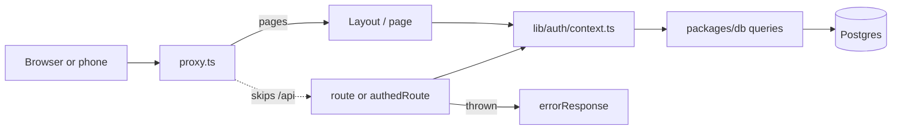
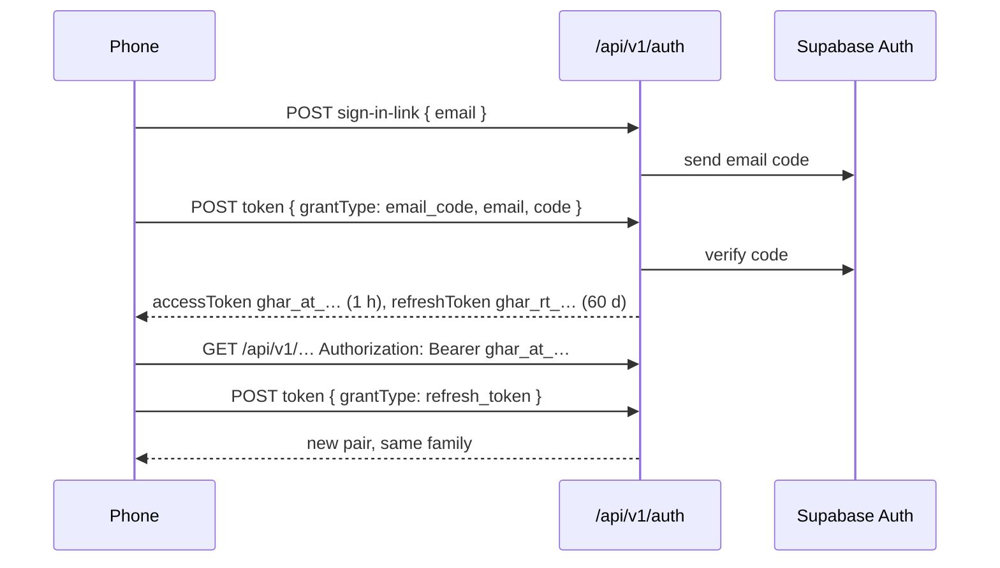

# Architecture

How Ghar is put together, and why. `CLAUDE.md` holds the rules; this explains how the code keeps
them. For operating production, see [runbook.md](runbook.md).

- [Workspace and boundaries](#workspace-and-boundaries)
- [A request, end to end](#a-request-end-to-end)
- [Authentication: cookies and bearer tokens](#authentication-cookies-and-bearer-tokens)
- [Data access and household scoping](#data-access-and-household-scoping)
- [The v1 API and its contracts](#the-v1-api-and-its-contracts)
- [Pagination](#pagination)
- [Delta sync](#delta-sync)
- [Providers and fakes](#providers-and-fakes)
- [Secrets and signed links](#secrets-and-signed-links)
- [Cron jobs](#cron-jobs)
- [Errors and monitoring](#errors-and-monitoring)
- [The installed web app](#the-installed-web-app)
- [Migrations](#migrations)
- [Checks](#checks)

## Workspace and boundaries

A pnpm workspace built with Turborepo. Packages ship TypeScript source with no build step: Next
consumes them through `transpilePackages`, Expo through Metro's `watchFolders`.

| Package              | Holds                                                          | May import                                   |
| -------------------- | -------------------------------------------------------------- | -------------------------------------------- |
| `packages/core`      | Pure domain rules: money, dates, permissions, errors, sync entity names | `zod`, `date-fns`, its own files              |
| `packages/contracts` | Zod schemas for every v1 endpoint, inferred types, a typed fetch client | `zod`, its own files                          |
| `packages/db`        | Drizzle schema, migrations, household-scoped query functions   | `core`, Drizzle, postgres-js. Server only    |
| `packages/tokens`    | Design tokens from `tokens.json`, emitted as CSS variables and a JS object | nothing                             |
| `apps/web`           | Next.js: pages, API routes, server actions, cron, every integration | everything above                         |
| `apps/mobile`        | Expo. A client of the v1 API                                   | `contracts`, `core`, `tokens`. Never `db`    |

The boundaries are enforced, not just described. The root `.oxlintrc.json` has
`no-restricted-imports` overrides:

- `core` and `contracts` may import only their allowlist. `node:*`, `next`, `react`, `@ghar/db` and
  any SDK fail lint.
- `apps/mobile/src` may not import `@ghar/db`, `node:*`, `next` or `server-only`.

When one of these fires, the code is in the wrong package. Move it rather than disabling the rule.
Placement follows purity, not topic: the price-drop threshold is pure and lives in `core`; the fare
lookup that feeds it is I/O and lives in `apps/web/lib/providers`.

Server-only modules in `apps/web/lib` start with `import 'server-only'`, so importing one from a
client component fails the build.

## A request, end to end



1. **`apps/web/proxy.ts`** runs on page requests only. It refreshes the Supabase session cookie and
   sends signed-out visitors to `/login`. It is a convenience, not the boundary: everything behind it
   checks the session again. Its matcher skips `/api/`, static files, the manifest, `sw.js` and
   `/offline`.
2. **`lib/auth/context.ts`** turns the request into a `RequestContext` of `{ userId, householdId, role }`.
   The household and role are read from `household_members` for the signed-in person, never from the
   request. Pages call `getPageContext()`, which redirects; handlers call `getRequestContext()`, which
   throws. Both are cached per request with React `cache()`.
3. **Route handlers** under `app/api/v1` are built with `route(endpoint, handler)` or
   `authedRoute(endpoint, handler)` from `lib/api`. The wrapper validates params, query and body
   against the contract before the handler runs, and validates the response after. A response outside
   its contract is a 500, not a leak.
4. **Handlers** parse, authorize, call `core` or `db`, and return. Orchestration that spans providers
   lives in `apps/web/lib/<area>`, not in the handler.
5. **Anything thrown** goes to `errorResponse`, which maps it through `describeError` in
   `@ghar/core/errors`. That is the only place error types become status codes, and server actions use
   the same function through `lib/actions/run.ts`.

Cookie-authenticated writes must carry a same-origin `Origin` header. Requests with an
`Authorization` header, or no cookies at all, carry no ambient credentials and skip that check.

## Authentication: cookies and bearer tokens

The web app signs in with a Supabase magic link and keeps Supabase's cookie. The phone can't rely on
cookies, so it gets Ghar's own tokens. Both reach the same `getSessionContext()`, and nothing after
it knows which was used.



- **Which credential counts.** A request with an `Authorization` header is judged by that header
  alone and never falls back to cookies. It must be a live `ghar_at_` token; a Supabase JWT is
  refused. Requests without the header use the cookie.
- **Storage.** Tokens are 32 random bytes. Only SHA-256 hashes are stored, in `api_tokens`.
- **Rotation.** Each sign-in starts a family; each refresh issues a new pair in that family and retires
  the old one. Presenting a refresh token that was already used revokes the whole family, which is what
  a stolen token looks like.
- **Household scope.** A token records the household it was issued for. If the person's household
  changes (they join, leave or create one), requests with the old token get a 401 and the phone
  refreshes to get a token for the new household.
- **Grant types.** `email_code` (the phone), `token_hash` (a magic link opened on the phone), and
  `refresh_token`.

Revoking tokens is in the [runbook](runbook.md#revoke-api-tokens).

## Data access and household scoping

Every query function in `packages/db/src/queries` takes `ctx: RequestContext` first and filters by
`ctx.householdId`. A household id from a body or query string is never used for scoping.

- **Permissions** come from `@ghar/core/auth`. `requirePermission(ctx, 'finances.manage')` throws
  `ForbiddenError`; `can(role, permission)` answers without throwing. Roles map to permissions in one
  table in `core`.
- **Tables without a household id**, such as a trip's itinerary or packing list, resolve their parent
  within the household first (`requireTrip` in `scope.ts`). Another household's id reads as not found,
  so ids can't be probed.
- **User ids from a request**, like a packing assignee, are checked to be household members
  (`requireHouseholdMembers`).
- **Row Level Security** is enabled on every table, with policies written in the migrations. The app
  connects through the Supabase pooler as a role that bypasses RLS, so RLS is the backstop for
  anything that reaches Postgres through Supabase's own APIs with a user's JWT. The query layer is the
  boundary.

The connection is one postgres-js pool per process (`getDb()` in `apps/web/lib/db.ts`), with
`prepare: false` because Supabase's transaction pooler doesn't support prepared statements, and a small
`max` because every serverless instance holds its own.

Money is `bigint` cents end to end and becomes text only in `formatCents`. Calendar dates are `date`;
instants are `timestamptz`; each household has a time zone that decides what "today" is.

## The v1 API and its contracts

The API is the mobile boundary: a capability that exists only as a server action or a page query
doesn't exist for the phone.

- **Contracts.** Each endpoint is a `defineEndpoint({ method, path, params?, query?, body?, response, access? })`
  in `packages/contracts/src/v1/<area>.ts`. The web route and the phone's typed client
  (`packages/contracts/src/client.ts`) both use the same object, so a change in one fails typecheck in
  the other.
- **Errors** share one shape: `{ error: { code, message, details?, requestId } }`, with the request id
  also in `x-request-id`.
- **Public endpoints** are marked `access: 'public'`: health, sign-in, token, and the one-tap link
  endpoints. `test/api-auth-coverage.test.ts` fails if any other route skips authentication.
- **Server actions** stay for simple web forms. Each calls the same `lib` function the matching v1
  route calls.

### OpenAPI

`packages/contracts/openapi.json` is generated from the Zod contracts and checked in. It's a Turbo
task so it caches on its inputs (`src/**`, `scripts/**` and the v1 route files, which supply success
statuses):

```bash
pnpm openapi
```

`packages/contracts/test/openapi.test.ts` fails when the checked-in file is stale. Both
`bearerAuth` and `cookieAuth` are declared; public operations have `security: []`.

## Pagination

Every v1 list endpoint pages with an opaque cursor: `?limit=&cursor=` in, `{ items, nextCursor }` out,
with `nextCursor: null` on the last page.

Paging is by keyset, never offset (`packages/db/src/queries/pagination.ts`). A page asks for rows
strictly after the last row of the previous one in the list's order, and every order ends with the
row's id, so rows added or removed while someone pages are never repeated or skipped. Where the sort
keys share a direction and aren't nullable, the condition is a row comparison an index on the same
columns can serve, like `transactions (household_id, date, id)`.

Sort keys travel as text, and timestamps keep Postgres's microseconds: a JavaScript `Date` rounds to
milliseconds and would lose rows written in the same one. A cursor comes from a client, so each value
is checked before it reaches a query; a bad one is a 400 telling the client to start again.

## Delta sync

The phone keeps a local copy and asks only for what changed: `GET /api/v1/sync?since=<cursor>`
returns `{ changes, deletes, nextSince, hasMore, resync }`. A synced record has the same shape the REST
endpoint for that resource returns, so a client can store either.

- **What changed.** Every syncable table has `updated_at`, stamped by a trigger rather than by the app.
  When a child changes (a vote on an itinerary option, a trip member), a trigger stamps the parent too,
  and the parent is sent with its children embedded. Deletes are written by triggers into
  `sync_tombstones` under the entity names in `SYNC_ENTITIES` (`@ghar/core/sync`), so renaming an entity
  is a migration.
- **Order.** Entities are walked in `SYNC_ENTITIES` order, parents before children, each in
  `(updated_at, id)` order. Deletes follow, in `(deleted_at, id)` order.
- **Snapshot.** The first page reads the database's clock (`clock_timestamp()`) once, so the snapshot
  and every `updated_at` share one clock. The walk reads rows changed after the floor and up to that
  snapshot, so it ends even while people keep writing.
- **Overlap.** When a walk finishes, `nextSince` starts the next one 60 seconds before the snapshot. A
  write that committed late, with an `updated_at` a little in the past, is still picked up. Clients see
  some rows twice and must apply changes idempotently.
- **Stateless cursor.** `since` is base64url JSON holding the household, user, role, floor, snapshot and
  position, validated strictly. Retrying a page is always safe. A cursor that doesn't parse is a 400.
  A cursor for another household, user or role returns `resync: true` and a fresh start: the client
  wipes its copy and walks again.
- **Same rules as the REST lists.** Each entity is read with the permission and row filters of its list
  endpoint (`SYNC_PERMISSIONS` in `packages/db/src/queries/sync.ts`). Booking drafts and digest
  preferences are per person. A row the caller could see before and can't now (a document marked
  sensitive, an accepted invitation, a booking draft no longer pending) is sent as a delete on an
  incremental sync.
- **Full sync.** Without `since`, every visible row is sent and no deletes.

The walk, the cursor and serialization live in `apps/web/lib/sync/service.ts`; per-entity reads live in
`packages/db/src/queries/sync.ts`.

Known limits:

- A write transaction open longer than the 60-second overlap can be missed until the row changes again.
- Some fields copy names from other rows (vendor, asset, account and inviter names) and can go stale
  until their own row changes. Fields computed from today's date drift the same way.
- Tombstones are never pruned. Pruning would need a retention window, with `resync` for any cursor older
  than it.
- A page that fills exactly at the end of the walk says `hasMore: true`, and the next page is empty.

## Providers and fakes

Every third-party service sits behind an adapter in `apps/web/lib/providers/<name>` that returns
Ghar's own types, never the vendor's response. Each has a fake, used by tests and by local development
without keys. The factory picks the real one only when its keys are set.

| Provider          | Real                            | Used for                                             |
| ----------------- | ------------------------------- | ---------------------------------------------------- |
| `email`           | Resend                          | Digests, reminders, invitations, alerts              |
| `email-otp`       | Supabase Auth                   | Emailed sign-in codes for the phone                  |
| `gmail`           | Gmail API, read-only scope      | Finding booking confirmations                        |
| `booking-extract` | Claude Haiku                    | Turning a confirmation email into a draft booking    |
| `google-calendar` | Google Calendar API             | Incremental calendar sync                            |
| `prices`          | Fare and hotel price sources    | Price watch                                          |
| `storage`         | Supabase Storage                | Document files, served through short-lived signed URLs |
| `opengraph`       | Page fetch                      | Link previews for trip ideas                         |
| `routing`         | Routing service                 | Travel times between itinerary stops                 |
| `monitoring`      | Sentry                          | Error reports and cron check-ins                     |

Model output and every third-party response is parsed with Zod before it becomes a domain type. A
booking the model extracts is only ever a draft that a person confirms.

Plaid has a data layer in `packages/db` (`plaid_items`, `accounts`, `applyTransactionSync`) but no
adapter, Link flow or sync job in `apps/web` yet.

## Secrets and signed links

`apps/web/lib/crypto.ts` seals secrets at rest with AES-256-GCM under `ENCRYPTION_KEY`:
Plaid access tokens, and Google Calendar and Gmail refresh tokens. A sealed value is
`v1.<iv>.<tag>.<ciphertext>`. Opening tries `ENCRYPTION_KEY` and then `ENCRYPTION_KEY_PREVIOUS`, which
is set only during a rotation; `pnpm --filter web secrets:reseal` re-seals stored values under the new
key. The procedure is in the [runbook](runbook.md#rotate-the-encryption-key).

Two HMAC keys are derived from `ENCRYPTION_KEY` with HKDF, each under its own label, so neither can be
used as the other:

- **One-tap links** (`lib/one-tap.ts`) in digest emails. Each is signed for one action on one entity,
  expires, and is used up by a row in `action_tokens`. They work without signing in. `/a/[token]` is
  the web page; `/api/v1/one-tap/[token]` is the API.
- **OAuth state for linking Google from the phone** (`lib/oauth-state.ts`), which lasts 10 minutes. The
  web flow keeps its state in a sealed cookie instead.

Rotating `ENCRYPTION_KEY` invalidates both kinds of signature immediately.

Secrets never appear in logs, API responses or error reports; `lib/providers/monitoring/scrub.ts`
redacts anything that looks like one before it leaves the process.

## Cron jobs

Vercel Cron calls `/api/cron/daily` (schedule in `apps/web/vercel.json`). The route is wrapped in
`runCron` from `lib/cron.ts`:

1. The request must carry `Authorization: Bearer ${CRON_SECRET}`, compared in constant time. With the
   secret unset, the route is locked, not open. A wrong secret gets a 401 and nothing else.
2. Each job runs through `runJob`, which writes a `job_runs` row (`running`, then `succeeded` or
   `failed` with an error) and never throws. One job failing doesn't stop the next.
3. A failed job is reported to monitoring and emailed to `ALERT_EMAIL`. The route answers 500 if any
   job failed, and the run checks in with the `daily-cron` Sentry monitor.

Every job is idempotent, so a re-run is always safe:

| Job                          | Why running it twice is harmless                                     |
| ---------------------------- | -------------------------------------------------------------------- |
| `travel.price_watch`         | An alert floor stops a second email about the same drop               |
| `calendar.sync`              | Incremental with Google's sync token                                  |
| `mail.booking_ingest`        | `mail_messages` records every message id it read; it gets a time budget |
| `documents.expiry_reminders` | Each reminder is claimed with a row before it's sent                  |

A per-link failure (one calendar, one inbox) is recorded on that link, not as a job failure. See the
[runbook](runbook.md#recover-a-failed-sync).

## Errors and monitoring

- **Typed errors.** Code throws `NotFoundError`, `ForbiddenError`, `ValidationError`, `ConflictError`
  and friends from `@ghar/core/errors`. `describeError` maps each to a status, a safe message and
  whether it's expected. Unexpected errors are reported; their messages are never shown.
- **Error boundaries.** `app/(app)/error.tsx` and `not-found.tsx` render inside the app shell. The
  top-level `error.tsx`, `not-found.tsx` and `global-error.tsx` render without it, and `login`,
  `onboarding`, `invite` and `a/[token]` have their own. Error pages show the digest as a reference that
  matches the server report.
- **Where errors are reported, once each.** API routes in `errorResponse`, server actions in
  `runAction`, and everything else Next catches in `onRequestError` (`instrumentation.ts`).
- **Monitoring adapter.** `lib/providers/monitoring` is Sentry when `SENTRY_DSN` is set and a fake that
  writes one redacted log line otherwise. It reads only its own variables, so it works when the rest of
  the environment is broken. No Sentry SDK ships in normal page bundles; an error page loads a small
  browser client only for an error the server never saw.

## The installed web app

The web app installs to a home screen as a standalone app.

- **Manifest.** `app/manifest.ts`: standalone display, paper theme and background colors, 192 and 512
  icons, a maskable icon. `layout.tsx` sets the iOS web app meta tags with the `default` status bar,
  which keeps dark status bar text on the light background, and `viewport-fit=cover` with safe-area
  padding in the app shell.
- **Service worker.** `public/sw.js`, registered in production only, versioned by deployment.
  - The offline page and icons are precached.
  - `_next/static` assets are cache first (they're immutable), up to 200.
  - Pages are network first. A page's HTML is saved after it loads, up to 30, and shown when the
    network fails or takes longer than 3 seconds. Sign-in, onboarding, invitations, one-tap links and
    the API are never saved. The page it serves is marked, and the app shows "Showing a saved copy"
    with a reload button.
  - Offline, writes get a 503 and the app holds form submissions with an "You’re offline" banner.
    Nothing is queued for later: the saved data is read-only.
- **Purging.** Saved pages hold household data, so they are deleted on sign-out, when `/login` loads,
  and when any navigation redirects to `/login`.

## Migrations

Drizzle Kit, checked into `packages/db/drizzle/`. An applied migration is never edited; a change is a
new migration.

```bash
pnpm db:generate
pnpm db:migrate
```

Migrations also carry what Drizzle can't express from the schema: RLS policies, the `updated_at`
triggers and the delete triggers that feed `sync_tombstones`. Foreign keys each have an index, and
`transactions` has `(household_id, date)` for the finances views.

## Checks

```bash
pnpm turbo run typecheck lint test
```

- **Tests** use Vitest. Database tests run against PGlite with the real migrations applied, so RLS,
  triggers and constraints are exercised, not mocked.
- **Lint** is oxlint, type-aware, including the boundary rules above.
- **OpenAPI** is checked for staleness by a test in `packages/contracts`.
